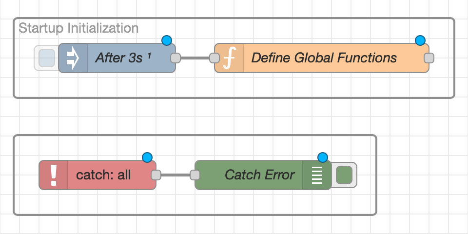
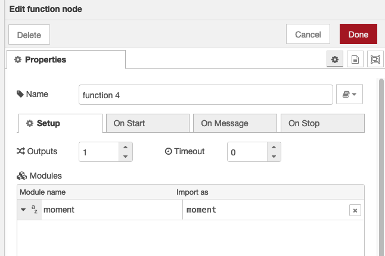

# Writing reusable code for Node-RED

Here we document a few strategies for including reusable code in a
[Node-RED](https://nodered.org/) deployment, and also with [Home
Assistant](https://www.home-assistant.io/). 

The easiest solution is to write your code in javascript within a [Function
Node](https://nodered.org/docs/user-guide/writing-functions). But maybe you want
to reuse your code across function nodes. Or include third party modules. Or
maybe you want to write your code in TypeScript and still use it within
Node-RED. Or even write your own custom Node-RED node. We look at all these
options here.


## ES6 and Typescript Compatibility

First let's recall we have `CommonJS` modules, loaded using `require`, and newer
ES6 modules, loaded using `import`.

Node-RED is not able to directly import ES6 modules. But we show you how you can
work around this limitation using dynamic importas. And without having to create
CommonJS modules for any of the modules you author. 

For your own modules, you should probably you use the Typescript compiler.
[Bun](https://bun.sh/) v1.0 has not been a good alternative because it cannot create
modules that can be nested and loaded under a parent module that is also created by Bun.


# Adding reusable code directly to Node-RED

The easiest solution is to just include reusable code in Node-RED by adding it
to a [Function Node](), adding that code to the global context, then retrieving
that context from other Function Nodes.

To do this you might wish to create a new _Library_ flow tab, then add an
[Inject Node](https://nodered.org/docs/user-guide/nodes#inject) and [Function
Node](https://nodered.org/docs/user-guide/writing-functions) to the flow. The
inject node is configured to inject once after 3 seconds, and connects to the
function node. 



The function node contains code such as the following:

```javascript
const gHA = global.get("homeassistant");
const ha = gHA.homeAssistant;

const global_functions = {

	googleDate: function (jsDate) {
		const d = new Date(jsDate);
    // the starting value for Google
		const tNull = new Date(Date.UTC(1899, 11, 30, 0, 0, 0, 0)); 
		return ((d.getTime() - tNull.getTime()) / 60000 - d.getTimezoneOffset()) / 1440;
	}
}
global.set("global_functions", global_functions);
```

Then, to use this code in other function nodes:

```javascript
const g = global.get("global_functions");
node.warn(g.googleDate(new Date()));
```

For reusable classes it is perhaps easiest to add a factory method that
instantiates the class:

```javascript
function newHA(options) {
  return new HA(options);
}

class HA {
  constructor(options) {
    this._ha = options.global.get('homeassistant');
  }

  get ha() {
    return this._ha;
  }
}

global.set('newHA',newHA)
```

```js
const newHA = global.get('newHA);
const gHA = newHA({})
```

Cons of this approach are that restricts you to editing code within the Node-RED
editor, you can't use Typescript, and you cannot run unit tests in an ordinary
sense.


# Loading External Modules

We discuss loading modules such as those found in the NPM repository.

## Locally referencing a module within a Function node

The _Edit function node > Setup_ tab allows you to add modules that can be used
within a particular function node. You do not need to restart the Node-RED
add-on to use this code. It will be imported when you deploy.



The module can then be easily referenced from your code:

```javascript
let m = moment(new Date()).format('YYYY-MM-DD')
```

Drawbacks of this approach are that you will need to replicate this procedure in
every function node where the module is used. And whether you have configured
this import is not visible from within the code editor.

For published packages this process is straight forward, as shown above in the UI. 

Referencing private packages works the same way. However you need to be careful how the module is referenced using a [git
URL](https://docs.npmjs.com/cli/v10/configuring-npm/package-json#git-urls-as-dependencies), and there may be limitations:

- You can't use SSH URLs from within the Node-RED Home Assistant add-on. This is due to SSH authentication issues.

- With Home Assistant, version and tag specifiers don't seem to work with the
  Home Assistant add-on. _TODO: Spend more time to confirm this
  behavior._

- Only `CommonJS` modules can be loaded. _TODO: Confirm_

## Global access to modules

Modules can be imported by Node-RED by including them in `package.json`. How you
do this differs depending on whether you have access to the Node-RED settings
folder or are using the Home Assistant Add-on. Once installed and loaded, these
modules will be available to all Function Nodes, and not just to the ones that
are configured as described above.

### Standalone Node-RED, not coupled with Home Assistant

When you run Node-RED on your local machine, Node-RED will by the default
instructions, be installed globally and, when run using the `node-red` command,
will create and use the folder `$HOME/.node-red` for it's setup. [Refer to the
Node-RED documentation for
details](https://nodered.org/docs/getting-started/local).

In this situation it is probably easiest to manually install packages using npm and `package.json`, and to load the packages at node-RED launch time using `$HOME/.node-red/settings.json`. 

There are some tricks to using `settings.json` and these will be discussed below under _Loading modules using settings.json_.

### Using the Home Assistant Node-RED Add-on

When using the [Node-RED Addon](https://github.com/hassio-addons/addon-node-red)
for Home Assistant, Node-RED is (I believe) running in a container where you
 don't have access to the tools needed (git, yarn, ssh keys). The best way to
add packages is to do so on the Home Assistant _Settings > Addons > Node-RED >
Configuration_ page. Make sure to use this syntax, which includes `git+https://`
at the beginning for any unpublished packages.

```yaml
npm_packages:
  - git+https://jpravetz@github.com/jpravetz/epdoc-node-red-utils
```

The package configuration mechanism used by the Node-RED addon has a number of
significant limitations, including that both the Node-RED and Node-RED addon
documentation are not transparent about what happens with updates. [I need to do
further investation by looking at the
code](https://github.com/hassio-addons/addon-node-red/issues/1679#issuecomment-1720141532). 

Be cautious of package updates, using unpublished packages, and of how
no-longer-used modules can still be loaded even if you think you've dereferenced
them. You will be tempted to directly edit `package.json`, and will want to edit
`settings.json` if you want to enable global module loading. I hope to obtain
clarification on these limitations.


Ugly workarounds are required. 

What I did at one ugly point in time was to just copy the entire text contents of
updated files from my dev editor, open the same file in Home Assistant (using
the Studio Code Server addon) and paste/overwrite the file contents of the old
file.

Another solution is to `scp` your files across and hand edit the `package.json` and
`package-lock.json` files to reflect the new commit values. I did this a couple of
times with success.

Eventually I published the code to npm, referenced it from the `package.json`
file, and restarted Node-RED within Home Assistant (this is done from the
_Settings > Add-ons > Node-RED_ page). For updates, I delete the appropriate
subfolder underneath `node_modules`, and restart Node-RED.

However there are still problems with this approach, as [I've discussed here](https://github.com/hassio-addons/addon-node-red/issues/1889).

## Loading modules using `settings.json`

Once you have a package installed, you will also need to tell Node-RED to load
the package, and then make the package available to any Function Nodes.

_CommonJS_ modules can be loaded using `require`. ES6 modules must be
[dynamically
imported](https://developer.mozilla.org/en-US/docs/Web/JavaScript/Reference/Operators/import). The code below shows how to modify `settings.json` to accomplish both.

```js
let settings = {
  // other stuff, not shown here

  functionGlobalContext: {
    "moment": require('moment')   // moment can use require
  }
}

async function loadModules() {
  // The ES6 modules to be loaded
  const names = [
    '@epdoc/typeutil',
    '@epdoc/timeutil',
    '@epdoc/node-red-hassio', // contains a custom node
    '@epdoc/node-red-hautil',
  ];
  let jobs = [];
  names.forEach((name) => {
    let job = import(name);
    jobs.push(job);
  });
  return Promise.all(jobs).then((resp) => {
    if (Array.isArray(resp) && resp.length === names.length) {
      for (let idx = 0; idx < names.length; ++idx) {
        settings.functionGlobalContext[names[idx]] = resp[idx];
      }
    }
  });
}

loadModules();

module.exports = settings;
```


### Using these external modules

As part of making your modules available to Function Nodes, you may with to
follow the strategy of [attaching them to the global
context](https://nodered.org/docs/user-guide/writing-functions#loading-additional-modules),
as shown below. Otherwise you are repeating setup to add your packages to every
Function Node. 

```js
// My resuable modules of library code
modules = {
  typeutil: '@epdoc/typeutil',
  timeutil: '@epdoc/timeutil',
  hautil: '@epdoc/node-red-hautil'
};
const lib = loadModules(global, modules);
if (lib.load_errors.length) {
  node.warn(`Error loading modules ${lib.load_errors.join(', ')}`);
}
global.set('lib', lib);

function loadModules(global, modules) {
  const lib = {
    load_errors: []
  };
  const fail = [];
  Object.keys(modules).forEach((key) => {
    const pkgName = modules[key];
    lib[key] = global.get(pkgName);
    if (!lib[key]) {
      lib.load_errors.push(pkgName);
    }
  });
  lib.haFactory = lib.hautil.newHAFactory(global);
  lib.util = {
    date: lib.timeutil.dateUtil,
    duration: lib.timeutil.durationUtil,
    ha: lib.hautil,
    type: lib.typeutil
  };
  return lib;
}
```

Then, to use this code in a Function Node, it's again a matter of accessing the global context:

```javascript
const t0 = new Date();
const lib = global.get('lib');
node.warn( `It has been ${lib.util.duration(new Date() - t0)} since we loaded this Function Node` );
```

Unfortunately, when editing code within the Function Node, there is no editor
code completion.

# Custom Nodes

Rather than making your code available as libraries, you may want to create your own custom node. This is a rather complicated process without enough  supporting examples or documentation. But we're still running our first custom node experiment [over here](https://github.com/epdoc/node-red-hassio).

# Resources

- Home Assistant Node-RED Add-on Issues
  - [Where did my Node-Red folder go?](https://community.home-assistant.io/t/where-did-my-node-red-folder-go/641467/11)
  - [Editing package.json dependencies does not stop old dependencies from coming back](https://github.com/hassio-addons/addon-node-red/issues/1889)
- [CommonJS vs. ES modules in Node.js](https://blog.logrocket.com/commonjs-vs-es-modules-node-js/)
