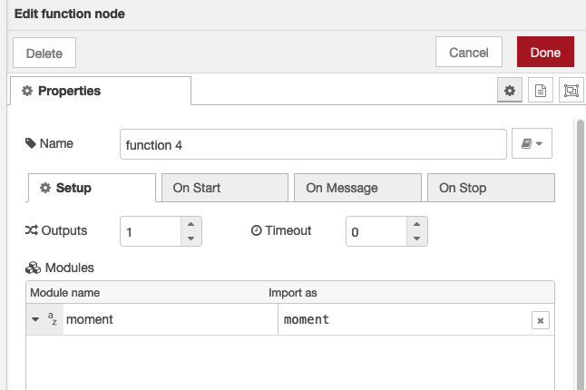

# hassio-node-red-utils

Utilities for my personal use of Node-RED with Home Assistant. Included are:

 * `HA` wrapper, to retrieve state from home assistant
 * `Service` wrapper, to generate payloads for use with the Call Service node.
 * A `setFan` function that is specific to my RF control of fans using both a
   [Bond Bridge](https://bondhome.io/product/bond-bridge/) to control speed, and
   wall switches to decouple the fans from power when they are off. I do this to
   prevent mains noise from blowing the delicate controllers on my Minka fans.
 * `LocationHistory` and `LocationMoving` classes that I use to monitor movement
   from our house, for gate automation purposes.
 * General `util` functions including a function to convert `Date` objects into
   a Google Spreadsheet datetime value.

I am also documentating here a few strategies for including reusable code in Node-RED.

## ES6 and Typescript Code Compatibility with Node-RED

The code in this repository is written in ECMAScript 2015 (ES6). This code will
work in Node-RED, but NODE-RED will not import ES6 modules.
I used [Babel](https://babeljs.io/docs/babel-plugin-transform-modules-commonjs) to
convert my ES6 modules to CommonJS that can be loaded using `require`.

Equally, you can use transpiled Typescript code, as I have shown when I add my
[general utilities package](https://github.com/jpravetz/epdoc-util) to Node-RED.

For classes I found it easiest to add a constructor method outside of the scope of the class.

```javascript
export function newHA(globalHomeAssistant, options) {
  return new HA(globalHomeAssistant, options);
}

export class HA {
  constructor(globalHomeAssistant, options) {
    this._ha = globalHomeAssistant.homeAssistant;
  }

  get ha() {
    return this._ha;
  }
} 
```

## Including published packages with Node-RED

The easiest technique here is to add these packages to the function editor > Setup tab.




then reference the code by the 'import as' value:


```javascript
let m = moment(new Date()).format('YYYY-MM-DD')
```

You do not need to restart the Node-RED add-on to use this code. It will be
imported when you deploy.

## Including unpublished packages with Node-RED

You can use the previous technique for loading unpublished git packages. This
refers to packages that are in public repositories, but that haven't been
published to npm. 

But the previous technique has limitations:

 * Lots of [git
URL](https://docs.npmjs.com/cli/v10/configuring-npm/package-json#git-urls-as-dependencies)
cut and paste
 * You can't use SSH URLs from within the Node-RED Home Assistant add-on
 * Version and tag specifiers don't seem to work with the add-on.

The [git
URL](https://docs.npmjs.com/cli/v10/configuring-npm/package-json#git-urls-as-dependencies)
cannot not use SSH, because othewise you will run into ssh authentication
issues, if your instance of Node-RED is an add-on to Home Assistant.

### Standalone Node-RED, not coupled with Home Assistant

I find it easiest to manually install and update unpublished packages using npm,
then referencing these packages from the function editor > Setup tab. For example

```shell
npm install git@github.com:jpravetz/epdoc-util.git
```

This allows you to control updates, and to use [git URLs as
dependencies](https://docs.npmjs.com/cli/v10/configuring-npm/package-json#git-urls-as-dependencies),
with no tag or version specifier limitations.

This is only applicable when you have full access to the machine where you are running
Node-RED, and you have all your usual tools installed on this machine. Node-RED
is actually quite easy to [install
locally](https://nodered.org/docs/getting-started/local).

### Home Assistant with the Node-RED add-on

In this situation  Node-RED is probably running in a container where you don't
have access to the tools needed (git, yarn, ssh keys). The best way to add
unpublished packages is to do so on the Home Assistant Settings > Addons > Node-RED >
Configuration page.

```yaml
npm_packages:
  - git+https://jpravetz@github.com/jpravetz/epdoc-node-red-utils
```

#### Limitation: No Updates!

This has a limitation in that you have no control over updates. You can't change
an entry to add a version specifier, and packages don't get updated to the
latest. 

Both the Node-RED and Node-RED addon documentation are not transparent about
what happens with updates. [I need to do further investation by looking at the code](https://github.com/hassio-addons/addon-node-red/issues/1679#issuecomment-1720141532). 

Ugly workarounds are required. 

What I found easist for myself was to just copy the entire text contents of
updated files from my dev editor, open the same file in Home Assistant (using
the Sudio Code Server addon) and paste/overwrite the file contents of the old
file.

Another solution is to `scp` your files across and hand edit the `package.json` and
`package-lock.json` files to reflect the new commit values. I did this a couple of
times with success.

## Adding code directly to Node-RED

If you don't need to develop and test your code in a separate project, you can
just include reusable code in Node-RED by adding it to a functions node, then
adding that code to the global context.

This is really the easier solution, except it restricts you editing code within
the Node-RED editor, you can't use Typescript, and means you can run unit tests
like `jest`.

What I do is create a new flow tab, then add an inject and function node to the
flow. The inject node is configured to inject once after 3 seconds, and connects
to the function node. The function node contains code such as the following:


```javascript
const gHA = global.get("homeassistant");
const ha = gHA.homeAssistant;

const global_functions = {

	googleDate: function (jsDate) {
		const d = new Date(jsDate);
		const tNull = new Date(Date.UTC(1899, 11, 30, 0, 0, 0, 0)); // the starting value for Google
		return ((d.getTime() - tNull.getTime()) / 60000 - d.getTimezoneOffset()) / 1440;
	}
}
global.set("global_functions", global_functions);
```

Then, to use this code in other function nodes:

```javascript
const g = global.get("global_functions");
node.warn(g.googleDate(new Date()));
```

## Using external code

This refers to the actual use of external modules from within your function nodes.

There are a few strategies for dealing with packages from external sources, but
I found it easist to [load my modules and attach them to the global
context](https://nodered.org/docs/user-guide/writing-functions#loading-additional-modules).
Otherwise you are repeating setup to add your packages to every function. 

Here
are the required changes to `settings.json`:

```json
  functionGlobalContext: {
    "epdoc-node-red-utils": require('epdoc-node-red-utils'),
    "epdoc-util": require('epdoc-util')
  },
```

Then, to use this code in other function, it's again a matter of accessing the global context:

```javascript
const g = global.get("epdoc-node-red-utils");
node.warn(g.googleDate(new Date()));
```

There is also the
[functionExternalModules](https://nodered.org/docs/user-guide/writing-functions#using-the-functionexternalmodules-option)
that can make it easier to use external modules. I haven't experimented with
this.
